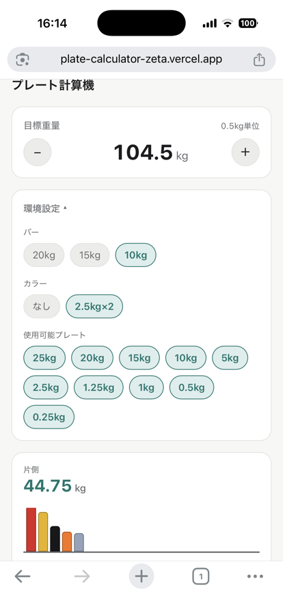
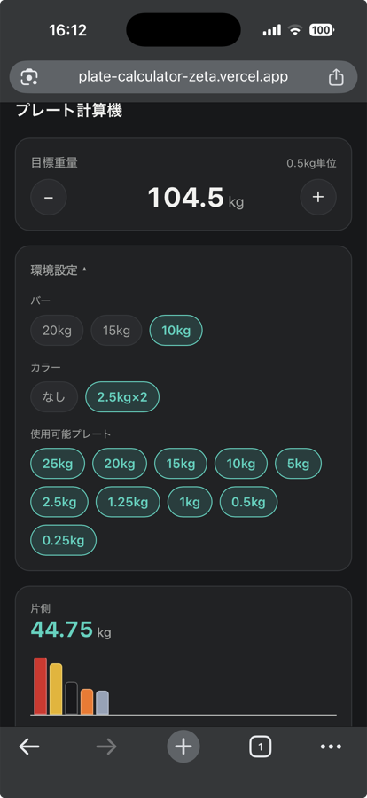
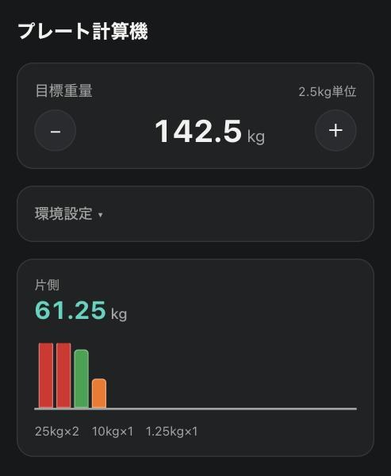
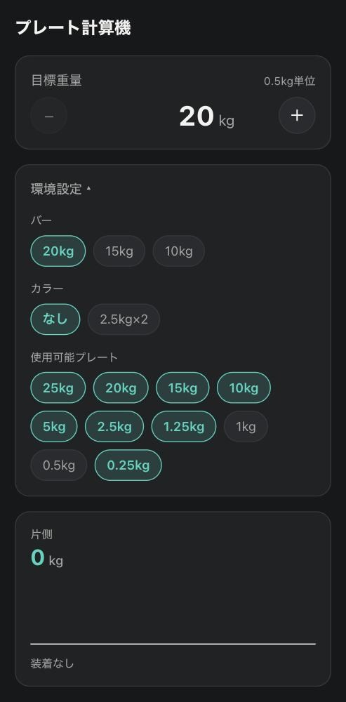

# プレート計算機

バーベルに着けるプレートの組み合わせを計算する Web アプリです。目標重量を入力すると、片側に着ける枚数を色つきで表示します。

**▶ https://plate-calculator-zeta.vercel.app/**

インストール不要。スマートフォンのブラウザでそのまま使えます。

<p>
  
  
</p>

実機の Safari で開いた状態。端末のライト / ダーク設定に追従します。

## はじめに

ジムでバーベルを組むとき、何をどう着けるかは毎回計算が必要です。ちょうど 100kg なら暗算できますが、記録を伸ばすには 2.5kg、1kg と細かく刻んでいくことになります。そして追い込んだ直後の息が上がった状態では、その簡単な計算を間違えます。**プレートの着け間違いは事故につながります。**

もうひとつ、パワーリフティングの大会現場では PC 1 台の画面をプロジェクターに映す方式が使われています。Web アプリにすれば、その場にいる全員が手元のスマートフォンから確認できます。

このアプリはその両方を出発点にしています。数字を読まなくても色と枚数で確認できること、片手で数タップで済むこと、そして **そのジムにあるプレートで実際に組める重量しか表示しないこと** を優先して作りました。

## 主な機能

- **目標重量から片側の構成を計算** — 入力するとその場で再計算します。計算ボタンはありません
- **手持ちのプレートに合わせる** — 使えるプレートの種別を on/off で切り替えられます。25kg がないジム、1.25kg までしかないジム、それぞれで正しい答えを出します
- **組めない重量は入力させない** — 入力の刻みは在庫から自動で決まります（下の「設計上の判断」を参照）
- **バー重量・カラーの切り替え** — バーは 20 / 15 / 10kg、カラーはあり（2.5kg × 2）/ なし
- **色つきのプレート表示** — 25kg 赤・20kg 青・15kg 黄は IPF 規定色。装着順も規定どおり内側から重い順に並びます
- **ライト / ダーク自動対応** — 端末の設定に追従します
- **キーボード操作・スクリーンリーダー対応**

<table>
  <tr>
    <td width="50%" valign="top"></td>
    <td width="50%" valign="top"></td>
  </tr>
  <tr>
    <td valign="top"><code>142.3</code> と入力すると <strong>142.5kg に丸まり</strong>、片側 61.25kg（25kg × 2 + 10kg + 1.25kg）が表示されます。</td>
    <td valign="top">環境設定で 0.25kg プレートを on にすると、入力の刻みが自動で <strong>「0.5kg 単位」</strong> に変わります。</td>
  </tr>
</table>

## 技術スタック

| 領域           | 使用技術                                            |
| -------------- | --------------------------------------------------- |
| フレームワーク | React 19 / TypeScript                               |
| ビルド         | Vite                                                |
| スタイル       | Tailwind CSS v4（CSS 変数でデザイントークンを定義） |
| テスト         | Vitest（32 ケース）                                 |
| 品質チェック   | ESLint / Prettier / husky（pre-commit）             |
| CI             | GitHub Actions（lint・format・test・build）         |
| ホスティング   | Vercel                                              |

状態管理ライブラリは使っていません。1 画面・4 つの state で足りる規模のため `useState` のみで構成しています。

計測値（本番・モバイル）: Lighthouse 4 項目 100 点 / Total Blocking Time 0ms / Cumulative Layout Shift 0 / 初回ロード約 68.5kB。

## 設計上の判断

### 計算ロジックを UI から切り離す

プレート計算（`src/lib/calculatePlates.ts`）は React に一切依存しない純粋関数です。入力を渡すと結果が返るだけなので、ブラウザを起動せずにテストできます。

戻り値は「判別可能 Union」の形にしました。成功したか失敗したかで **返ってくるデータの形自体が変わる** ため、UI 側は成功したときにしか存在しない値をうっかり参照できません。

```ts
type CalculatePlatesResult =
  | {
      ok: true
      achievedPerSideWeight: number
      breakdown: PlateBreakdownItem[]
      shortfall: number
    }
  | { ok: false; reason: 'targetBelowMinimum'; minimumWeight: number }
  | { ok: false; reason: 'invalidInput' }
```

### 入力の刻みを固定値ではなく在庫から決める

バーベルは左右対称なので、**合計重量は「片側に足した分の 2 倍」でしか動きません。** つまりそのジムで実現できる最小の増分は「使えるいちばん軽いプレート × 2」で決まります。

刻みを 0.5kg などに固定すると、1.25kg までしかないジムで「組めない重量」を入力できてしまいます。在庫から導けば、どの環境でも自動的に正しくなります。副産物として、0.25kg プレートを on にすると刻みが 0.5kg になり、これは IPF の記録更新の最小幅と一致します。

### エラーを出すのではなく、エラーになる値を作らせない

目標重量を変える経路（直接入力・± ボタン・環境設定の変更）はすべて 1 つの正規化関数を通ります。下限（バー + カラー）と上限で挟んでから刻みに丸めるため、**画面に出ている数字と計算結果がズレません。**

「142.3kg と表示されているのに内部では 142.5kg で計算している」状態を作らないための設計です。グラム単位で記録を狙う人にとって、この不一致は許容できません。

### ± ボタンは「刻み 1 つ分」動く

当初 ± ボタンの増減幅を 2.5kg 固定にしていたところ、刻みが粗い環境（5kg プレートまでしかない等）で **ボタンを押しても丸めに戻されて動かない** バグが出ました。「ボタンが何 kg 動くべきか」を決める責任がどこにも置かれていなかったことが原因です。

増減幅を刻みの整数倍にすれば、丸めが介入する余地がなくなります。現在は「± ボタンは 1 刻み動く」を仕様とし、全在庫パターンで ± が対称に動くことをテストで固定しています。

### 仕様は一次情報で確定する

プレートの色やディスクの規格は、参考記事ではなく IPF Technical Rulebook を直接読んで決めました。その結果、**IPF が色を規定しているのは 25kg（赤）・20kg（青）・15kg（黄）の 3 種だけ** で、10kg 以下は "any color" と明記されていることが分かりました。ソースコードのコメントでも、規定色と慣習色を区別して記録しています。

## ローカルでの動かし方

Node.js 24 以上が必要です。

```bash
git clone https://github.com/Matsutake29/plate-calculator.git
cd plate-calculator
npm install
npm run dev
```

| コマンド               | 内容                            |
| ---------------------- | ------------------------------- |
| `npm run dev`          | 開発サーバーを起動              |
| `npm test`             | テストを実行                    |
| `npm run lint`         | ESLint                          |
| `npm run format:check` | Prettier のフォーマットチェック |
| `npm run build`        | 型チェック込みの本番ビルド      |

## 今後の展望

現在は重量計算のみです。将来的には大会の進行支援まで広げたいと考えています。

- GL ポイントの自動計算
- 大きい増分ボタン（刻みが細かいときの押下回数を減らす）
- プレート枚数の管理（現在は各種別が無制限にある前提）
- lbs 対応
- 選手名簿・次の挑戦重量の表示（個人や事務局規模の大会での利用を想定）
